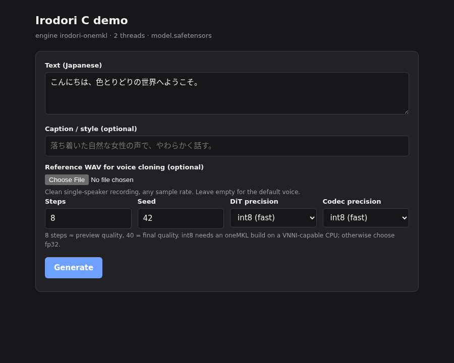

# Irodori C demo

A minimal web UI for the [Irodori C](https://github.com/misaalya/irodori-c)
inference engine (Japanese TTS, CPU). Python standard library only — no
framework, no build step. The page posts JSON to a tiny HTTP server that runs
the engine binary as a subprocess (one request at a time) and returns the WAV
together with the engine's stage timings.



## Running from the prebuilt release (Linux x86-64, no compiler)

Requirements: Linux x86-64 with AVX2 (any CPU from ~2013 on), glibc ≥ 2.35
(Ubuntu / Pop!_OS 22.04 or newer), `curl`, `python3`, ≥ 4 GB RAM, ≈ 4 GB disk.
The int8 "fast" options additionally need AVX-512 VNNI (Intel 10th-gen Ice
Lake or newer, AMD Zen 4 or newer); on other CPUs choose fp32 in the UI.

```sh
# 1. download the engine and the assets tarball
curl -LO https://github.com/misaalya/irodori-c/releases/download/v0.2.0/irodori-c-v0.2.0-linux-x86_64.tar.gz
curl -LO https://github.com/misaalya/irodori-c/releases/download/v0.2.0/irodori-c-assets-v0.2.0.tar.gz

# 2. unpack both into one directory
tar xzf irodori-c-v0.2.0-linux-x86_64.tar.gz
cd irodori-c-v0.2.0-linux-x86_64
tar xzf ../irodori-c-assets-v0.2.0.tar.gz --strip-components=1

# 3. fetch the FP32 checkpoint (~3 GB, once)
./download-model.sh            # or: ./download-model.sh phasefield-audio/Irodori-TTS-v4.1-Anime

# 4. start the UI
./run-demo.sh                  # open http://127.0.0.1:8080
```

Useful variants:

- `IRO_NUM_THREADS=4 ./run-demo.sh` — set the engine thread count to your
  number of physical cores (default 2).
- `./run-demo.sh --binary bin/irodori-blas` — FP32-only OpenBLAS build for CPUs
  without VNNI.
- `./run-demo.sh --host 0.0.0.0 --port 8080` — reachable from other devices on
  the LAN (no authentication; trusted networks only).
- `./run-demo.sh --model /path/to/other/model.safetensors` — any checkpoint
  with the v4.1-Small architecture.

Windows: use WSL2 (Ubuntu 22.04) and follow the same steps.

## Running from source

Build the engine as described in the [engine README](https://github.com/misaalya/irodori-c#quick-start-from-source)
(`make blas`, or `make irodori-onemkl MKL_ROOT=…` for int8) and prepare
`weights/` (`tokenizer.bin`, `dacvae_decoder.safetensors`,
`dacvae_encoder.safetensors`, `model.safetensors`). This repository is checked
out as `demo/` inside the engine directory (`git clone --recurse-submodules`).
Then:

```sh
python3 demo/server.py                    # from the engine directory
```

Without arguments the server picks the first of `irodori-onemkl`,
`irodori-blas`, `irodori-mkl` next to `demo/`, uses `<engine>/weights`, and
looks for the model at `weights/model.safetensors`, then `$IRO_MODEL`.
Relative paths are resolved against the current directory first and the
engine directory second. Options: `--binary`, `--weights`, `--model`,
`--threads`, `--host`, `--port`, `--outputs`. Missing pieces are reported at
startup with what to do.

## Using the page

- **Text** (Japanese), optional **caption** (voice design) and optional
  **reference WAV** (voice cloning; clean single-speaker recording).
- **Steps** 8 for quick previews, 40 for final quality; **seed** for
  reproducibility.
- **DiT / codec precision**: `int8` is 2–4× faster, `fp32` reproduces the
  PyTorch reference exactly.
- The result shows the audio player, stage timings (encode / sampling /
  decode), engine total with RTF, wall time and the engine log.

## API

- `GET /api/info` — engine binary name, model name, thread count, encoder
  availability (no filesystem paths are exposed).
- `POST /api/generate` — JSON `{text, caption?, reference_wav_base64?, steps,
  seed, dit_precision, codec_precision}` → `{wav_url, audio_seconds,
  encode_seconds, sample_seconds, decode_seconds, total_seconds, rtf,
  wall_seconds, log}`.
- `GET /outputs/<job>.wav` — generated audio (supports byte ranges).

Generated files are kept in `outputs/` (gitignored). The server is meant for
local use and has no authentication.

## Credits

Engine base implementation by OpenAI Codex; performance refinement, int8
paths and this demo by Claude. Model: [Irodori-TTS](https://github.com/Aratako/Irodori-TTS)
by Chihiro Arata (MIT, with the authors' ethical restrictions on voice cloning).
